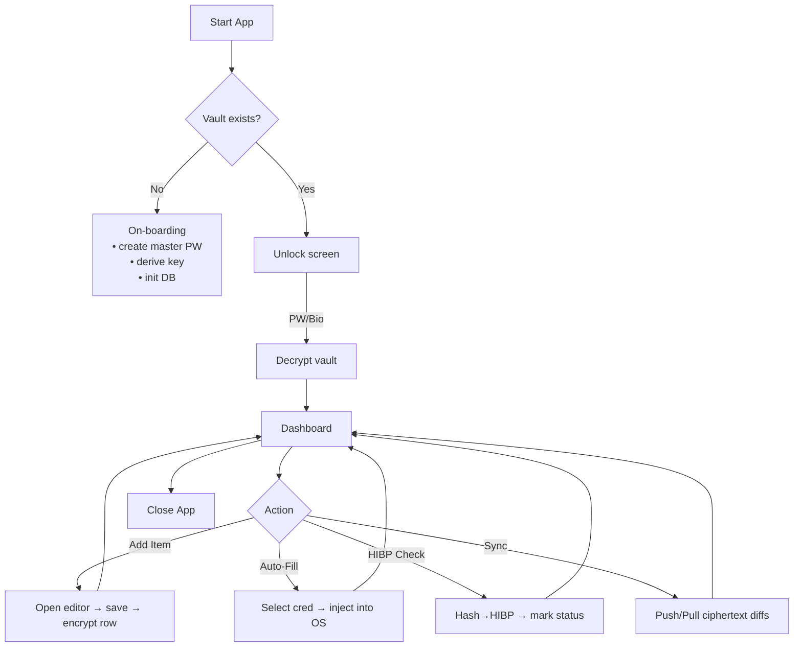
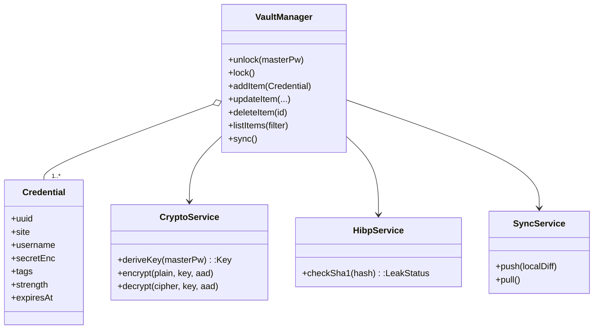

**Secret Plan – Cross‑Platform Password Manager**

---

### 1 · Summary

Secret Plan is a zero‑knowledge password manager delivered as a single code‑base desktop + mobile application via **Tauri 2**. All secrets are protected locally with **Argon2 key‑derivation → AES‑256‑GCM vault encryption**; only ciphertext is ever synchronised. Key goals include leak monitoring with the HIBP API, auto‑fill on iOS/Android/desktop browsers, multi‑factor unlock, and fine‑grained audit logs.

---

### 2 · Core Use‑Cases

1. **Initial On‑boarding** – create master password → derive key → open empty vault.  
2. **Unlock Vault** – enter master password / Touch ID / Face ID; decrypt local store.  
3. **Credential CRUD** – add · edit · delete secrets (site / user / password / notes).  
4. **Password Generator** – build strong password given length/charset rules.  
5. **Search & Filter** – live filtering by site, tag, strength, or breach status.  
6. **Auto‑Fill** – Tauri plug‑ins adapt to iOS Password AutoFill, Android Autofill, and desktop browser injections.  
7. **Leak Monitor** – hashed lookup in HIBP; flag compromised logins.  
8. **Sync & Backup** – end‑to‑end‑encrypted vault replication plus offline AES‑GCM export/import.  
9. **Security Analytics** – strength meter, expiry reminders, full audit trail.

---

### 3 · Activity Diagram



---

### 4 · High‑Level Architecture

```mermaid
graph LR
    subgraph Frontend (Svelte 5 + Tailwind 4)
        UI[Reactive UI] -->|IPC| IPC[(Tauri API)]
    end
    subgraph Core (Tauri Rust)
        IPC --> VaultMgr[Vault Manager<br/>AES‑GCM · Argon2]
        VaultMgr --> DB[(Encrypted SQLite)]
        VaultMgr --> Sync[Sync Service<br/>(Cloud R2/S3/WebDAV)]
        VaultMgr --> OSInt[OS Integration<br/>Autofill · Biometrics]
        VaultMgr --> Breach[HIBP Client]
        Breach -->|k‑Anon SHA‑1| API[(HIBP API)]
    end
    subgraph Cloud (optional)
        Sync <--> Storage[(Object Store)]
    end
```

*Reasons*:

* **Tauri 2** gives a small binary and secure Rust side‑car for cryptography.  
* **Svelte 5 runes** provide ultra‑light reactivity; Tailwind 4 ensures consistent styling.  
* Separation keeps encryption keys in Rust memory only; UI layer never touches plaintext.

---

### 5 · Data Storage Design

| Table         | Columns                                                                                                                                                                                | Notes                                                         |
| ------------- | -------------------------------------------------------------------------------------------------------------------------------------------------------------------------------------- | ------------------------------------------------------------- |
| `meta`        | `id TEXT PK`, `value BLOB`                                                                                                                                                             | Encrypted app settings (argon params, theme, etc.)            |
| `vault_items` | `uuid TEXT PK`, `site TEXT`, `username TEXT`, `secret BLOB`, `tags TEXT`, `created_at INTEGER`, `updated_at INTEGER`, `expires_at INTEGER`, `strength INTEGER`, `breach_state INTEGER` | `secret` contains AES‑GCM‑sealed JSON {password, notes, totp} |
| `audit_log`   | `id INTEGER PK`, `timestamp INTEGER`, `action TEXT`, `item_uuid TEXT`                                                                                                                  | Immutable log for security review                             |

* All tables live in **SQLite** wrapped by [sqlcipher]/`rust‑sqlite` with page‑level AES‑GCM; the entire file is again envelope‑encrypted before sync.  
* Row‑level random IVs prevent pattern leakage.  

---

### 6 · UI Mock‑ups (wire description)

| Screen              | Primary Regions                                                                                                                                                           | Interaction Hints (Tailwind 4)                                 |
| ------------------- | ------------------------------------------------------------------------------------------------------------------------------------------------------------------------- | -------------------------------------------------------------- |
| **Unlock**          | Centered card (`w‑80`, `rounded‑2xl`, `shadow‑lg`, `p‑6`) – password field, Touch ID button, “Forgot key?” link.                                                          | Shake‑on‑error via `animate‑shake`.                            |
| **Dashboard**       | Side bar (`w‑60`, gradient bg) listing tags / folders; main pane grid (`grid md:grid‑cols‑3 gap‑4 p‑6`) of credential cards; top bar search (`input input‑ghost w‑full`). | `@apply` for hover‑scale on cards, strength‑meter colored bar. |
| **Edit Item Modal** | Dialog overlay; form groups with floating labels; password generator drawer slides in from right (`transition‑slide‑in`).                                                 |
| **Settings**        | Tabs: “Security”, “Sync”, “Appearance”, “About”. Each uses `prose` for text and toggle switches (`data‑[state=checked]:bg‑primary`).                                      |

---

### 7 · Class Diagram (domain layer)



---

### 8 · Applied Design Patterns

| Concern                                | Pattern                                                 | Motive                                                    |
| -------------------------------------- | ------------------------------------------------------- | --------------------------------------------------------- |
| **Single instance of decrypted vault** | **Singleton** (`VaultManager`)                          | Avoid multiple in‑memory plaintext copies.                |
| **Reactive UI on data change**         | **Observer** (Svelte store subscribed to IPC events)    | Push‑based updates keep UI in sync.                       |
| **Pluggable crypto / KDF options**     | **Strategy** (`CryptoService` picks Argon2id vs scrypt) | Future‑proof algorithm swaps.                             |
| **Password generation rules**          | **Builder**                                             | Fluent API lets UI compose charset/length constraints.    |
| **Auto‑fill OS bridges**               | **Adapter** (iOS vs Android vs Desktop)                 | Uniform vault API over heterogeneous autofill frameworks. |
| **Undo for credential edits**          | **Command**                                             | Enqueues reversible operations recorded in audit log.     |
| **Network/offline sync**               | **Repository**                                          | Local persistence stays isolated from sync transport.     |
