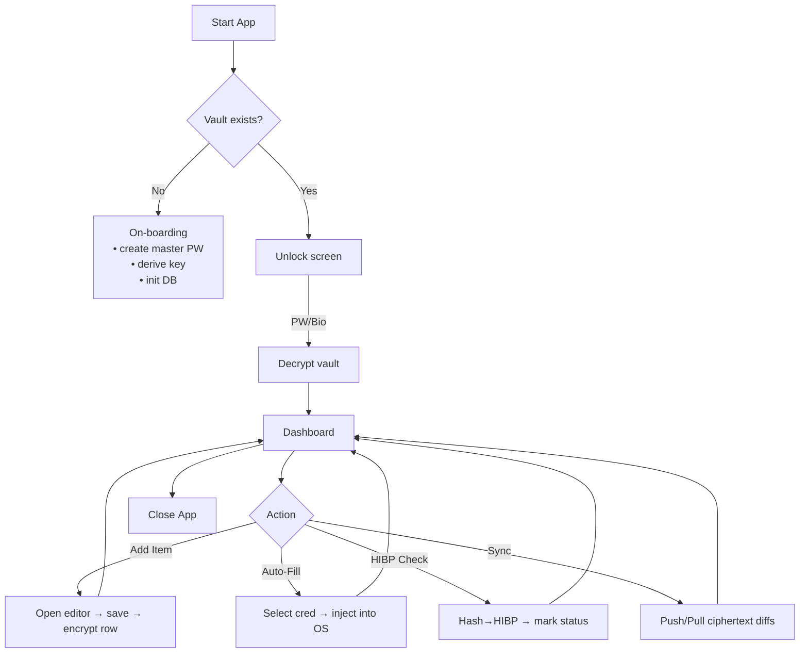
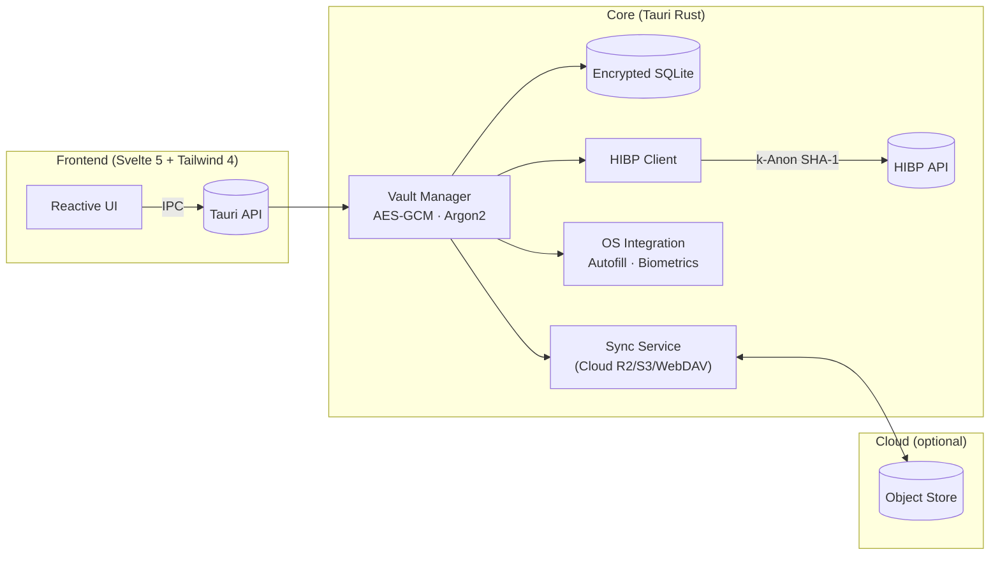

**Secret Plan – Cross‑Platform Password Manager**

---

### 1 · Summary

Secret Plan is a zero‑knowledge password manager delivered as a single code‑base desktop + mobile application via **Tauri 2**. All secrets are protected locally with **Argon2 key‑derivation → AES‑256‑GCM vault encryption**; only ciphertext is ever synchronised. Key goals include leak monitoring with the HIBP API, auto‑fill on iOS/Android/desktop browsers, multi‑factor unlock, and fine‑grained audit logs.

---

### 2 · Core Use‑Cases & Implementation Status

| Use-Case            | Status      | Notes                                                  |
| ------------------- | ----------- | ------------------------------------------------------ |
| Initial On‑boarding | Implemented | Master password, key derivation, DB init               |
| Unlock Vault        | Implemented | Password unlock; biometrics planned                    |
| Credential CRUD     | Implemented | Add/edit/delete secrets                                |
| Password Generator  | Partial     | Function exists; builder pattern planned               |
| Search & Filter     | Implemented | Live filtering by site/tag/strength/breach             |
| Auto‑Fill           | Planned     | No OS/browser integration yet                          |
| Leak Monitor (HIBP) | Partial     | HIBP check implemented; no background/flag UI          |
| Sync & Backup       | Planned     | No cloud sync or envelope encryption yet               |
| Security Analytics  | Partial     | Strength meter; no expiry reminders or reuse detection |
| Audit Log           | Partial     | Audit log exists; not all actions consistently logged  |
| Undo/Redo           | Planned     | Command pattern not implemented                        |
| Multi-factor Unlock | Planned     | Biometrics/multi-factor not implemented                |

---

### 3 · Activity Diagram



---

### 4 · High‑Level Architecture



_Legend: `:::planned` = planned/not yet implemented_

_Reasons_:

- **Tauri 2** gives a small binary and secure Rust side‑car for cryptography.
- **Svelte 5 runes** provide ultra‑light reactivity; Tailwind 4 ensures consistent styling.
- Separation keeps encryption keys in Rust memory only; UI layer never touches plaintext.

---

### 5 · Data Storage Design

| Table         | Columns                                                                                                                                                                                    | Notes                                                        |
| ------------- | ------------------------------------------------------------------------------------------------------------------------------------------------------------------------------------------ | ------------------------------------------------------------ |
| `meta`        | `key TEXT PK`, `value BLOB NOT NULL`, `nonce BLOB`                                                                                                                                         | Stores encrypted app settings (argon params, theme, etc.)    |
| `vault_items` | `uuid TEXT PK`, `site TEXT`, `username TEXT`, `secret_enc TEXT`, `tags TEXT`, `created_at INTEGER`, `updated_at INTEGER`, `expires_at INTEGER`, `strength INTEGER`, `breach_state INTEGER` | `secret_enc` is base64-encoded JSON container (nonce+cipher) |
| `audit_log`   | `id INTEGER PRIMARY KEY AUTOINCREMENT`, `timestamp INTEGER`, `action TEXT`, `item_uuid TEXT`                                                                                               | Immutable log for security review                            |

- All tables live in **SQLite** wrapped by [sqlcipher]/`rust‑sqlite` with page‑level AES‑GCM; the entire file is again envelope‑encrypted before sync (**planned**).
- Row‑level random IVs prevent pattern leakage.

---

### 6 · UI Mock‑ups (wire description)

| Screen              | Primary Regions                                                                                                                                                           | Interaction Hints (Tailwind 4)                                 |
| ------------------- | ------------------------------------------------------------------------------------------------------------------------------------------------------------------------- | -------------------------------------------------------------- |
| **Unlock**          | Centered card (`w‑80`, `rounded‑2xl`, `shadow‑lg`, `p‑6`) – password field, Touch ID button.                                                                              | Shake‑on‑error via `animate‑shake`.                            |
| **Dashboard**       | Side bar (`w‑60`, gradient bg) listing tags / folders; main pane grid (`grid md:grid‑cols‑3 gap‑4 p‑6`) of credential cards; top bar search (`input input‑ghost w‑full`). | `@apply` for hover‑scale on cards, strength‑meter colored bar. |
| **Edit Item Modal** | Dialog overlay; form groups with floating labels; password generator drawer slides in from right (`transition‑slide‑in`).                                                 |
| **Settings**        | Tabs: “Security”, “Sync”, “Appearance”, “About”. Each uses `prose` for text and toggle switches (`data‑[state=checked]:bg‑primary`).                                      |

---

### 7 · Class Diagram (domain layer)


---

### 8 · Applied Design Patterns & Implementation Status

| Concern                                | Pattern                                                 | Motive                                                    | Status          |
| -------------------------------------- | ------------------------------------------------------- | --------------------------------------------------------- | --------------- |
| **Single instance of decrypted vault** | **Singleton** (`VaultManager`)                          | Avoid multiple in‑memory plaintext copies.                | Implemented     |
| **Reactive UI on data change**         | **Observer** (Svelte store subscribed to IPC events)    | Push‑based updates keep UI in sync.                       | Planned         |
| **Pluggable crypto / KDF options**     | **Strategy** (`CryptoService` picks Argon2id vs scrypt) | Future‑proof algorithm swaps.                             | Partial         |
| **Password generation rules**          | **Builder**                                             | Fluent API lets UI compose charset/length constraints.    | Planned         |
| **Auto‑fill OS bridges**               | **Adapter** (iOS vs Android vs Desktop)                 | Uniform vault API over heterogeneous autofill frameworks. | Planned         |
| **Undo for credential edits**          | **Command**                                             | Enqueues reversible operations recorded in audit log.     | Planned         |
| **Network/offline sync**               | **Repository**                                          | Local persistence stays isolated from sync transport.     | Partial (local) |

---

### 9 · Known Gaps & TODOs

- **SyncService, envelope encryption, and cloud backup**: Not yet implemented.
- **Biometric/multi-factor unlock**: Not yet implemented.
- **Password generator builder pattern**: Not yet implemented.
- **Undo/redo (Command pattern)**: Not yet implemented.
- **Audit log coverage**: Not all actions are consistently logged.
- **Autofill/OS integration**: Not yet implemented.
- **Security analytics (expiry, reuse, reminders)**: Not yet implemented.

---

# Svelte 5 Runes & Patterns Reference

Use these patterns and examples to steer toward Svelte 5 idioms and away from deprecated Svelte 4 APIs.

## 1. Reactivity (Runes)

| Rune                | Purpose                                   | Example                                        |
| ------------------- | ----------------------------------------- | ---------------------------------------------- |
| **$state**          | Reactive primitives & deep proxies        | `let count = $state(0)`                        |
|                     |                                           | `let todos = $state([{…}])`                    |
| **$state.raw**      | Immutable snapshot                        | `let cfg = $state.raw({a:1,b:2})`              |
| **$state.snapshot** | Strip proxies for external libs           | `const snap = $state.snapshot(todos)`          |
| **$derived(expr)**  | Auto‑updating read‑only                   | `const dbl = $derived(count * 2)`              |
| **$derived.by(fn)** | Complex derived logic                     | `const sum = $derived.by(()=>arr.reduce(...))` |
| **$effect(fn)**     | Side‑effects when dependencies change     | `$effect(()=> console.log(count))`             |
| **$effect.pre(fn)** | Run before DOM updates (e.g. auto‑scroll) | `$effect.pre(()=>{/*…*/})`                     |

```ts
// deep reactive proxy
let todos = $state<{ text: string; done: boolean }[]>([{ text: 'Learn Svelte', done: false }]);

// immutable config
let cfg = $state.raw({ baseUrl: 'https://api.example.com' });

// snapshot for external lib
function send(data) {
	api.post('/save', $state.snapshot(todos));
}

// simple derived
const remaining = $derived(todos.filter((t) => !t.done).length);

// complex derived
const stats = $derived.by(() => ({
	total: todos.length,
	done: todos.filter((t) => t.done).length
}));

// side‑effect + cleanup
$effect(() => {
	console.log(`You have ${remaining} tasks left`);
	return () => console.clear();
});

// pre‑DOM update (auto‑scroll)
let chatContainer = $state<HTMLElement>();
let messages = $state<string[]>([]);
$effect.pre(() => {
	messages.length; // track length
	if (chatContainer) {
		tick().then(() => chatContainer.scrollTo(0, chatContainer.scrollHeight));
	}
});
```

## 2. Props & Binding

- **$props()**
  ```ts
  let { foo, bar = 'x' } = $props(); // destructure + defaults
  ```
- **$bindable**
  ```svelte
  let {(value = $bindable())} = $props();
  <input bind:value />
  <!-- two‑way -->
  ```
- **Unique IDs**
  ```ts
  const uid = $props.id(); // stable per instance
  ```

```ts
// destructure + defaults + bindable
<script lang="ts">
  interface Props { value?: string; disabled?: boolean }
  let { value = $bindable(''), disabled = $bindable(false) }: Props = $props();
</script>

<input bind:value bind:disabled />
```

```ts
// unique IDs
const uid = $props.id();

// pass callback prop
let { onSave }: { onSave: (data: any) => void } = $props();
<button onclick={() => onSave($state.snapshot(todos))}>Save</button>
```

## 3. Event Handling

- **Inline handlers**
  ```svelte
  <button onclick={(e) => count++}>…</button>
  ```
- **Shorthand** (named `onclick`)
  ```svelte
  function onclick() {count++}
  <button {onclick}>…</button>
  ```
- **Callback props** (no `createEventDispatcher`)
  ```svelte
  <!-- Child.svelte -->
  let {onAction} = $props();
  <button onclick={() => onAction(data)}>Do</button>
  ```
- **Modifiers** (manual wrappers)
  ```ts
  const once = (fn) => (e) => {
  	fn(e);
  	fn = null;
  };
  const preventDefault = (fn) => (e) => {
  	e.preventDefault();
  	fn(e);
  };
  ```
- **Multiple handlers**
  ```svelte
  <button
  	onclick={(e) => {
  		a(e);
  		b(e);
  	}}>…</button
  >
  ```
- **Spread + merge**
  ```svelte
  <button
  	{...props}
  	onclick={(e) => {
  		local(e);
  		props.onclick?.(e);
  	}}
  />
  ```

```svelte
<script lang="ts">
	let count = $state(0);
	function onclick() {
		count += 1;
	} // shorthand
	const preventOnce = once(preventDefault(() => alert('Clicked!')));
</script>

<button {onclick}>Clicked {count}</button>
<button onclick={preventOnce}>Once & no default</button>
```

```svelte
<!-- merge props + local -->
<script lang="ts">
	let props = $props<{ onclick?: (e: MouseEvent) => void }>();
	function local(e: MouseEvent) {
		console.log('local');
	}
</script>

<button
	{...props}
	onclick={(e) => {
		local(e);
		props.onclick?.(e);
	}}
>
	Combined
</button>
```

## 4. Snippets (Slots Replacement)

- **Define**
  ```svelte
  {#snippet item(d)}
  	<li>{d}</li>
  {/snippet}
  ```
- **Render**
  ```svelte
  {@render item(fruit)}
  ```
- **Pass to components**
  ```svelte
  <Table {header} {row} />
  ```

```svelte
{#snippet header()}
	<h1>{title}</h1>
{/snippet}

{#snippet row(item)}
	<tr>
		<td>{item.name}</td>
		<td>{item.qty}</td>
	</tr>
{/snippet}

<Table data={items} {header} {row} />
```

## 5. Advanced APIs

- **$host()**
  ```ts
  $host().dispatchEvent(new CustomEvent('evt'));
  ```
- **$inspect**
  ```ts
  $inspect(count, todos);              // log changes
  $inspect(count).with((t,v)=>…);      // custom
  $inspect.trace();                    // inside $effect
  ```

```ts
// dispatch from custom element
<svelte:options customElement="x-chart" />
<script lang="ts">
  function update(data) {
    $host().dispatchEvent(new CustomEvent('update', { detail: data }));
  }
</script>
```

```ts
// inspect + trace
let stateA = $state(0),
	stateB = $state(0);
$inspect(stateA, stateB).with((type, ...vals) => console.log(type, vals));
$effect(() => {
	$inspect.trace();
	doWork();
});
```

## 6. TypeScript Patterns

- **Enable**: `<script lang="ts">`
- **Typed props**
  ```ts
  interface Props {
  	name: string;
  }
  let { name }: Props = $props();
  ```
- **Generic components**
  ```svelte
  <script lang="ts" generics="T">
  	interface Props {
  		items: T[];
  		onSelect: (t: T) => void;
  	}
  	let { items, onSelect }: Props = $props();
  </script>
  ```
- **Typed state**
  ```ts
  let count: number = $state(0);
  ```

```svelte
<script lang="ts" generics="Item">
	interface Props {
		items: Item[];
		renderItem: (item: Item) => any;
		onSelect: (item: Item) => void;
	}
	let { items, renderItem, onSelect }: Props = $props();
</script>

<ul>
	{#each items as it}
		<li onclick={() => onSelect(it)}>{@render renderItem(it)}</li>
	{/each}
</ul>
```

```ts
// typed state + derived
let count: number = $state(0);
const parity: 'even' | 'odd' = $derived(count % 2 === 0 ? 'even' : 'odd');
```

## 7. Migration Mapping

| Svelte 4                      | Svelte 5                                 |
| ----------------------------- | ---------------------------------------- |
| `$:` labels                   | `$state` / `$derived` / `$effect`        |
| `<slot>`                      | `#snippet` / `@render`                   |
| `on:click`                    | `onclick={…}` / `{onclick}`              |
| `createEventDispatcher`       | callback props + `$host()` for custom el |
| `$on/$set/$destroy`           | event props / direct state / `unmount`   |
| `<svelte:component this={C}>` | `<C/>` with `$state`                     |

## 8. **Complex Mixed Example: Collaborative Todo App**

```svelte
<!-- App.svelte -->
<script lang="ts">
	import TodoList from './TodoList.svelte';
	let todos = $state<{ text: string; done: boolean }[]>([]);

	function add(text: string) {
		todos.push({ text, done: false });
	}

	function save(snapshot) {
		/* send to server */
	}
</script>

<TodoList {todos} onAdd={add} onSave={save} />
```

```svelte
<!-- TodoList.svelte -->
<script lang="ts">
	export interface Todo {
		text: string;
		done: boolean;
	}
	interface Props {
		todos: Todo[];
		onAdd: (t: string) => void;
		onSave: (snap: Todo[]) => void;
	}
	let { todos, onAdd, onSave }: Props = $props();

	let input = $state('');
	const remaining = $derived(todos.filter((t) => !t.done).length);

	$effect(() => console.log(`Remaining: ${remaining}`));

	function handleAdd() {
		onAdd(input.trim());
		input = '';
	}
</script>

{#snippet controls()}
	<input bind:value onkeydown={(e) => e.key === 'Enter' && handleAdd()} placeholder="New task" />
	<button onclick={handleAdd}>Add</button>
	<button onclick={() => onSave($state.snapshot(todos))}>Sync</button>
{/snippet}

{#snippet item(todo, idx)}
	<li>
		<input type="checkbox" bind:checked={todo.done} />
		{todo.text}
	</li>
{/snippet}

<div>
	<p>{remaining} open tasks</p>
	<ul>
		{#each todos as t, i}
			{@render item(t, i)}
		{/each}
	</ul>
	{@render controls()}
</div>
```
