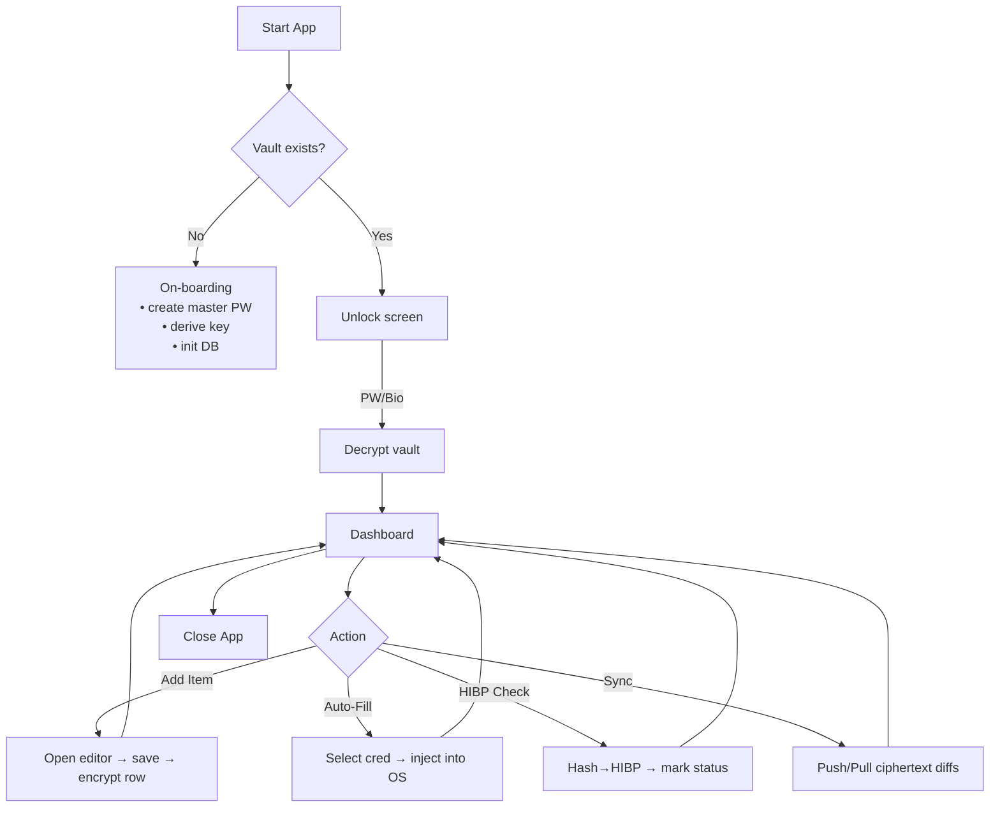
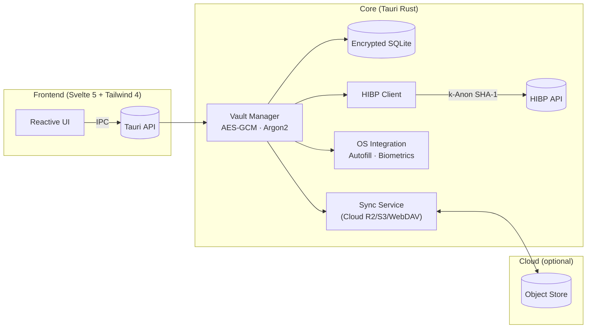
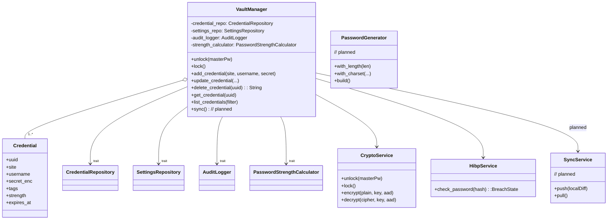

**Secret Plan – Cross‑Platform Password Manager**

---

### 1 · Summary

Secret Plan is a zero‑knowledge password manager delivered as a single code‑base desktop + mobile application via **Tauri 2**. All secrets are protected locally with **Argon2 key‑derivation → AES‑256‑GCM vault encryption**; only ciphertext is ever synchronised. Key goals include leak monitoring with the HIBP API, auto‑fill on iOS/Android/desktop browsers, multi‑factor unlock, and fine‑grained audit logs.

---

### 2 · Core Use‑Cases & Implementation Status

| Use-Case            | Status      | Notes                                                  |
| ------------------- | ----------- | ------------------------------------------------------ |
| Initial On‑boarding | Implemented | Master password, key derivation, DB init               |
| Unlock Vault        | Implemented | Password unlock; biometrics planned                    |
| Credential CRUD     | Implemented | Add/edit/delete secrets                                |
| Password Generator  | Partial     | Function exists; builder pattern planned               |
| Search & Filter     | Implemented | Live filtering by site/tag/strength/breach             |
| Auto‑Fill           | Planned     | No OS/browser integration yet                          |
| Leak Monitor (HIBP) | Partial     | HIBP check implemented; no background/flag UI          |
| Sync & Backup       | Planned     | No cloud sync or envelope encryption yet               |
| Security Analytics  | Partial     | Strength meter; no expiry reminders or reuse detection |
| Audit Log           | Partial     | Audit log exists; not all actions consistently logged  |
| Undo/Redo           | Planned     | Command pattern not implemented                        |
| Multi-factor Unlock | Planned     | Biometrics/multi-factor not implemented                |

---

### 3 · Activity Diagram

---

### 4 · High‑Level Architecture

*Legend: `:::planned` = planned/not yet implemented*

*Reasons*:

* **Tauri 2** gives a small binary and secure Rust side‑car for cryptography.  
* **Svelte 5 runes** provide ultra‑light reactivity; Tailwind 4 ensures consistent styling.  
* Separation keeps encryption keys in Rust memory only; UI layer never touches plaintext.

---

### 5 · Data Storage Design

| Table         | Columns                                                                                                                                                                                    | Notes                                                        |
| ------------- | ------------------------------------------------------------------------------------------------------------------------------------------------------------------------------------------ | ------------------------------------------------------------ |
| `meta`        | `key TEXT PK`, `value BLOB NOT NULL`, `nonce BLOB`                                                                                                                                         | Stores encrypted app settings (argon params, theme, etc.)    |
| `vault_items` | `uuid TEXT PK`, `site TEXT`, `username TEXT`, `secret_enc TEXT`, `tags TEXT`, `created_at INTEGER`, `updated_at INTEGER`, `expires_at INTEGER`, `strength INTEGER`, `breach_state INTEGER` | `secret_enc` is base64-encoded JSON container (nonce+cipher) |
| `audit_log`   | `id INTEGER PRIMARY KEY AUTOINCREMENT`, `timestamp INTEGER`, `action TEXT`, `item_uuid TEXT`                                                                                               | Immutable log for security review                            |

* All tables live in **SQLite** wrapped by [sqlcipher]/`rust‑sqlite` with page‑level AES‑GCM; the entire file is again envelope‑encrypted before sync (**planned**).  
* Row‑level random IVs prevent pattern leakage.  

---

### 6 · UI Mock‑ups (wire description)

| Screen              | Primary Regions                                                                                                                                                           | Interaction Hints (Tailwind 4)                                 |
| ------------------- | ------------------------------------------------------------------------------------------------------------------------------------------------------------------------- | -------------------------------------------------------------- |
| **Unlock**          | Centered card (`w‑80`, `rounded‑2xl`, `shadow‑lg`, `p‑6`) – password field, Touch ID button.                                                                              | Shake‑on‑error via `animate‑shake`.                            |
| **Dashboard**       | Side bar (`w‑60`, gradient bg) listing tags / folders; main pane grid (`grid md:grid‑cols‑3 gap‑4 p‑6`) of credential cards; top bar search (`input input‑ghost w‑full`). | `@apply` for hover‑scale on cards, strength‑meter colored bar. |
| **Edit Item Modal** | Dialog overlay; form groups with floating labels; password generator drawer slides in from right (`transition‑slide‑in`).                                                 |
| **Settings**        | Tabs: “Security”, “Sync”, “Appearance”, “About”. Each uses `prose` for text and toggle switches (`data‑[state=checked]:bg‑primary`).                                      |

---

### 7 · Class Diagram (domain layer)

---

### 8 · Applied Design Patterns & Implementation Status

| Concern                                | Pattern                                                 | Motive                                                    | Status          |
| -------------------------------------- | ------------------------------------------------------- | --------------------------------------------------------- | --------------- |
| **Single instance of decrypted vault** | **Singleton** (`VaultManager`)                          | Avoid multiple in‑memory plaintext copies.                | Implemented     |
| **Reactive UI on data change**         | **Observer** (Svelte store subscribed to IPC events)    | Push‑based updates keep UI in sync.                       | Planned         |
| **Pluggable crypto / KDF options**     | **Strategy** (`CryptoService` picks Argon2id vs scrypt) | Future‑proof algorithm swaps.                             | Partial         |
| **Password generation rules**          | **Builder**                                             | Fluent API lets UI compose charset/length constraints.    | Planned         |
| **Auto‑fill OS bridges**               | **Adapter** (iOS vs Android vs Desktop)                 | Uniform vault API over heterogeneous autofill frameworks. | Planned         |
| **Undo for credential edits**          | **Command**                                             | Enqueues reversible operations recorded in audit log.     | Planned         |
| **Network/offline sync**               | **Repository**                                          | Local persistence stays isolated from sync transport.     | Partial (local) |

---

### 9 · Known Gaps & TODOs

- **SyncService, envelope encryption, and cloud backup**: Not yet implemented.
- **Biometric/multi-factor unlock**: Not yet implemented.
- **Password generator builder pattern**: Not yet implemented.
- **Undo/redo (Command pattern)**: Not yet implemented.
- **Audit log coverage**: Not all actions are consistently logged.
- **Autofill/OS integration**: Not yet implemented.
- **Security analytics (expiry, reuse, reminders)**: Not yet implemented.

---
